# 🚀 Order Pipeline DIY

<div align="center">

**Event-Driven Observability from Scratch**

[](https://dotnet.microsoft.com/)
[](https://www.rabbitmq.com/)
[](https://opentelemetry.io/)
[](https://www.jaegertracing.io/)
[](LICENSE)

*Building a production-grade event-driven pipeline with full observability stack - **no managed services, just pure engineering**.*

[Architecture](#-architecture) • [Features](#-features) • [Quick Start](#-quick-start) • [Documentation](#-documentation) • [Research](#-academic-research)

</div>

---

## 📖 Overview

This project is a **DIY (Do-It-Yourself) implementation** of a complete event-driven order processing pipeline with enterprise-grade observability. Unlike managed cloud solutions, every component is built and configured manually to understand the true cost and complexity of production systems.

### 🎯 Purpose

- **Academic Research**: Comparative study on serverless observability patterns
- **Learning Resource**: Hands-on implementation of distributed tracing, structured logging, and resilience patterns
- **Benchmark**: Baseline for comparing DIY vs Azure-managed solutions

### 🌟 Why This Matters

Most tutorials show you how to use managed services. This project shows you:
- ✅ What happens **under the hood**
- ✅ The **real effort** behind observability
- ✅ How to implement **production patterns** from scratch
- ✅ The **trade-offs** between DIY and managed solutions

---

## 🏗️ Architecture

```mermaid
graph LR
    Client[👤 Client] -->|POST /orders| API[🌐 API]
    API -->|OrderCreated| RMQ[📮 RabbitMQ]
    RMQ -->|consume| VW[✅ ValidationWorker]
    VW -->|OrderValidated| RMQ
    VW -->|OrderRejected| RMQ
    RMQ -->|consume| PW[💳 PaymentWorker]
    PW -->|OrderPaid| RMQ
    PW -->|retry 3x| PW
    PW -->|failed| DLQ[☠️ Dead Letter Queue]
    RMQ -->|consume| NW[📧 NotificationWorker]
    DLQ -->|consume| CW[⚠️ CompensationWorker]
    RMQ -->|consume| CW
    
    API -.logs/traces.-> OBS[📊 Observability Stack]
    VW -.logs/traces.-> OBS
    PW -.logs/traces.-> OBS
    NW -.logs/traces.-> OBS
    CW -.logs/traces.-> OBS
    
    OBS --> SEQ[Seq]
    OBS --> JAEGER[Jaeger]
    OBS --> PROM[Prometheus]
    
    style API fill:#4CAF50
    style RMQ fill:#FF6600
    style DLQ fill:#f44336
    style OBS fill:#2196F3
```



### 📊 Event Flow

1. **OrderCreated** → Validation
2. **OrderValidated** → Payment Processing
3. **OrderPaid** → Customer Notification
4. **OrderRejected** / **PaymentDeadLetter** → Compensation

---

## ✨ Features

### 🔍 Observability (The Core Focus)

- **Structured Logging** with [Serilog](https://serilog.net/)
  - Console, File, and [Seq](https://datalust.co/seq) sinks
  - Correlation ID propagation across all services
  - Contextual properties (OrderId, CustomerId, EventType)

- **Distributed Tracing** with [OpenTelemetry](https://opentelemetry.io/)
  - End-to-end trace visualization in [Jaeger](https://www.jaegertracing.io/)
  - Automatic span creation for HTTP and messaging
  - Custom instrumentation for business operations

- **Metrics** with Prometheus + Grafana
  - Request rates, latencies (P50, P95, P99)
  - Error rates and DLQ counts
  - Custom business metrics

### 💪 Resilience Patterns

- **Retry with Exponential Backoff** (via [Polly](https://github.com/App-vNext/Polly))
- **Dead Letter Queue** for poison messages
- **Compensating Transactions** (Saga pattern)
- **Circuit Breaker** (optional)

### 🏃 Performance Testing

- **Stress Testing** with [k6](https://k6.io/)
- Load profiles: Spike, Stress, Soak tests
- Automated breaking point detection

---

## 🚀 Quick Start

### Prerequisites

- [.NET 8 SDK](https://dotnet.microsoft.com/download)
- [Docker Desktop](https://www.docker.com/products/docker-desktop)
- [Git](https://git-scm.com/)

### 1️⃣ Clone & Setup

```bash
git clone https://github.com/LuisMarchio03/order-pipeline-diy.git
cd order-pipeline-diy

# Start infrastructure (RabbitMQ, Jaeger, Seq)
docker-compose up -d
```

### 2️⃣ Build & Run

```bash
# Restore dependencies
dotnet restore

# Run API (Terminal 1)
dotnet run --project OrderPipeline.Api

# Run Workers (Terminals 2-5)
dotnet run --project OrderPipeline.ValidationWorker
dotnet run --project OrderPipeline.PaymentWorker
dotnet run --project OrderPipeline.NotificationWorker
dotnet run --project OrderPipeline.CompensationWorker
```

### 3️⃣ Test the Flow

```bash
# Create a valid order
curl -X POST http://localhost:5000/api/orders \
  -H "Content-Type: application/json" \
  -d '{"customerId": "customer-123", "amount": 100.50}'

# Create an invalid order (will be rejected)
curl -X POST http://localhost:5000/api/orders \
  -H "Content-Type: application/json" \
  -d '{"customerId": "", "amount": -10}'
```

### 4️⃣ Explore Observability

| Tool | URL | Credentials |
|------|-----|-------------|
| **RabbitMQ Management** | http://localhost:15672 | guest / guest |
| **Jaeger UI** (Traces) | http://localhost:16686 | - |
| **Seq** (Logs) | http://localhost:5341 | - |
| **Prometheus** | http://localhost:9090 | - |
| **Grafana** | http://localhost:3000 | admin / admin |

---

## 📚 Documentation

- **[Architecture Decision Records](docs/adr/)** - Why we made specific choices
- **[API Documentation](docs/api.md)** - Endpoints and contracts
- **[Event Catalog](EVENTS.md)** - All events and their schemas
- **[Resilience Patterns](RESILIENCE.md)** - Retry, DLQ, and compensation strategies
- **[Observability Guide](OBSERVABILITY_GUIDE.md)** - How to debug with logs & traces
- **[Stress Testing Guide](docs/stress-testing.md)** - Breaking point analysis

---

## 🧪 Testing

### Unit & Integration Tests

```bash
dotnet test
```

### Load Testing

```bash
# Install k6
brew install k6  # macOS
choco install k6  # Windows

# Run spike test (find breaking point)
k6 run load-tests/spike-test.js

# Run stress test (gradual increase)
k6 run load-tests/stress-test.js

# Run soak test (3-hour endurance)
k6 run load-tests/soak-test.js
```

---

## 🎓 Academic Research

This project is part of a Master's research on **"Developer-Friendly Observability in Event-Driven Serverless Architectures"**.

### Research Questions

1. How does manual observability implementation compare to managed cloud solutions?
2. What is the developer experience cost of DIY observability?
3. Which patterns are most effective for event-driven systems?

### Comparison Study

This DIY version will be compared with:
- **Version B**: Azure Functions + Service Bus + Application Insights

### Key Metrics

- Lines of code for observability
- Time to implement
- Debugging efficiency (time to root cause)
- Breaking points (RPS, latency)

---

## 🗂️ Project Structure

```
order-pipeline-diy/
├── OrderPipeline.Contracts/          # Event contracts & models
├── OrderPipeline.Infrastructure/     # RabbitMQ, Logging, Tracing, Metrics
├── OrderPipeline.Api/                # HTTP API (ASP.NET Core)
├── OrderPipeline.ValidationWorker/   # Validation service
├── OrderPipeline.PaymentWorker/      # Payment processing
├── OrderPipeline.NotificationWorker/ # Customer notifications
├── OrderPipeline.CompensationWorker/ # Failure handling
├── load-tests/                       # k6 stress tests
├── docs/                             # Documentation
├── docker-compose.yml                # Infrastructure setup
└── README.md                         # You are here 📍
```

---

## 🛠️ Technology Stack

| Category | Technology | Purpose |
|----------|------------|----------|
| **Runtime** | .NET 8 | Modern, high-performance platform |
| **API** | ASP.NET Core | REST API framework |
| **Messaging** | RabbitMQ | Event-driven communication |
| **Logging** | Serilog + Seq | Structured logging |
| **Tracing** | OpenTelemetry + Jaeger | Distributed tracing |
| **Metrics** | Prometheus + Grafana | Time-series metrics |
| **Resilience** | Polly | Retry & circuit breaker |
| **Testing** | k6 | Load & stress testing |
| **Containerization** | Docker | Infrastructure isolation |

---

## 📈 Performance Results

> **Note**: Results from stress testing on MacBook Pro M1, 16GB RAM

| Metric | Value |
|--------|-------|
| **Max Sustained RPS** | ~1,200 req/s |
| **P95 Latency (normal)** | 45ms |
| **P95 Latency (stress)** | 280ms |
| **Breaking Point** | ~2,000 req/s (CPU saturation) |
| **Max DLQ Rate** | 2.3% (at breaking point) |

*Full results in [STRESS_TEST_RESULTS.md](STRESS_TEST_RESULTS.md)*

---

## 🤝 Contributing

Contributions are welcome! This is a research project, but improvements are appreciated.

1. Fork the repository
2. Create a feature branch (`git checkout -b feature/amazing-improvement`)
3. Commit your changes (`git commit -m 'Add amazing improvement'`)
4. Push to the branch (`git push origin feature/amazing-improvement`)
5. Open a Pull Request

---

## 📝 License

This project is licensed under the MIT License - see the [LICENSE](LICENSE) file for details.

---

## 🌟 Acknowledgments

- **OpenTelemetry Community** for the amazing tracing framework
- **Serilog Team** for structured logging made simple
- **Polly Contributors** for resilience patterns
- **k6 Team** for developer-friendly load testing

---

## 📧 Contact

**Author**: Luis Marchio  
**Institution**: 
**Purpose**: Academic Research 
**Year**: 2025-2026

**Questions?** Open an issue or reach out via [GitHub Discussions](https://github.com/LuisMarchio03/order-pipeline-diy/discussions)

---

<div align="center">

**⭐ If this project helps your learning or research, consider starring it!**

[🐛 Report Bug](https://github.com/LuisMarchio03/order-pipeline-diy/issues) • [💡 Request Feature](https://github.com/LuisMarchio03/order-pipeline-diy/issues) • [📖 Documentation](https://github.com/LuisMarchio03/order-pipeline-diy/wiki)

</div>
